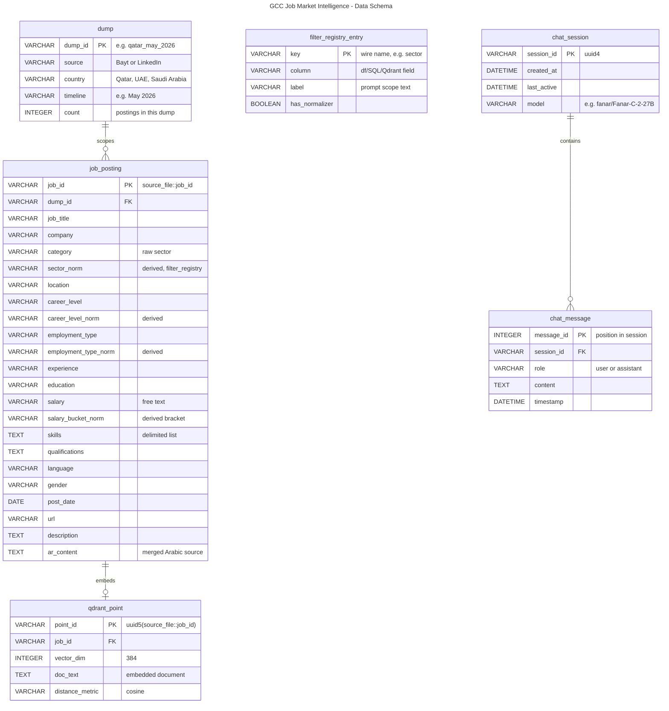

# Data Schema

This isn't a traditional relational database — there's no persistent multi-table
SQL schema with foreign keys. The real data lives in three different places:

1. **One flat table** (`job_posting`) — the ~30.8K postings, loaded from Excel
   into a pandas DataFrame at startup. `sql_engine.py` copies the *currently
   scoped subset* into an ephemeral, single-table in-memory SQLite database
   per query — created fresh, queried, discarded. Nothing persists there
   between requests.
2. **Qdrant Cloud** (`qdrant_point`) — a vector database, not relational.
   Each posting is embedded once into a point (id, 384-dim vector, payload).
3. **In-memory chat state** (`chat_session` / `chat_message`) — lives in a
   process dict with a 2-hour idle TTL (`session.py`), never written to disk.

The diagram below models these as logical entities so the *shape* of the data
is documented in one place, not because a real foreign-key-enforced schema
exists. Source of truth for column names: `RAG/vector_store.py`'s
`_DOC_FIELDS`/`_META_COLS`, `RAG/filter_registry.py`, and `RAG/server.py`'s
`_EXPORT_POSTING_COLUMNS`.



GitHub renders this natively — no image, no external service. `filter_registry_entry`
has no formal relationship line: it describes *columns* of `job_posting`
(metadata about the schema), not rows that reference them.

## Regenerating

The Mermaid block above was generated from [`RAG/schema.er`](RAG/schema.er)
(eralchemy's markdown-ER format) via:

```bash
pip install eralchemy
eralchemy -i RAG/schema.er -o schema_mermaid.md -m mermaid_er
```

Two things worth knowing if you regenerate:
- eralchemy's mermaid output has a real bug with `?` (zero-or-one) cardinality —
  it emits the literal words `1--one or zero` instead of valid Mermaid crow's-foot
  syntax (`||--o|`), which fails to parse. Fix by hand, or avoid `?` relationships.
- It also mojibakes em-dashes/pipe characters in `{label:"..."}` text (encoding
  bug) — stick to plain ASCII in labels.
- The image-embed fallback it produces (`mermaid.ink`) depends on an external
  service; the fenced ` ```mermaid ` block above doesn't and is what GitHub
  actually renders — prefer that over the raw CLI output.

Image/PDF output (`-o schema.png`) needs Graphviz installed system-wide
(`dot` on PATH) — not currently installed in dev. The Mermaid path above was
chosen specifically to avoid that dependency, and renders natively on GitHub
without it.
